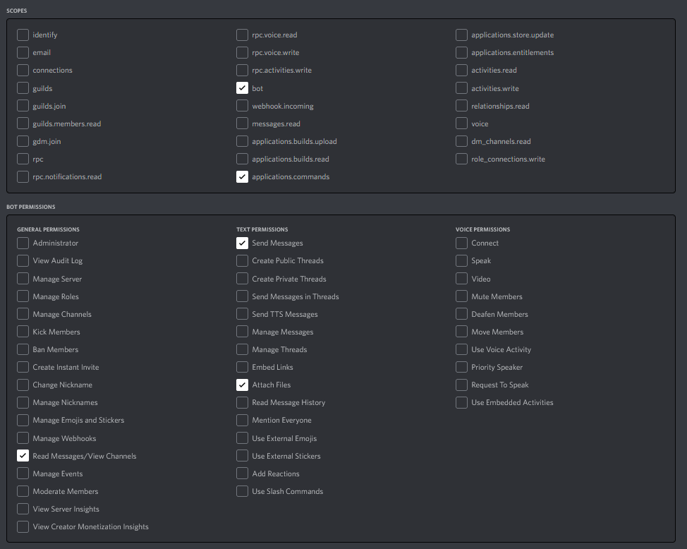

# Timelapse Bot

This is a Discord bot that compiles images captured for timelapse from anywhere with an internet connection.


## Add your bot
Create a [Discord application](https://discord.com/developers) and create a link with the following scopes and permissions:



---
## Installation

1. Clone this repository:

    `git clone https://github.com/ConnorSwis/timelapse-bot.git`

2. Install dependancies:

    `npm install`

    `pip install -r requirements.txt`

3. Configure bot:

    Create a `.env` file in the project directory.

    ```conf
    TOKEN=<discord bot token>
    clientID=<discord bot ID>
    ```

4. Run build script:

    `npm run build`

5. Run Bot:

    `npm start`